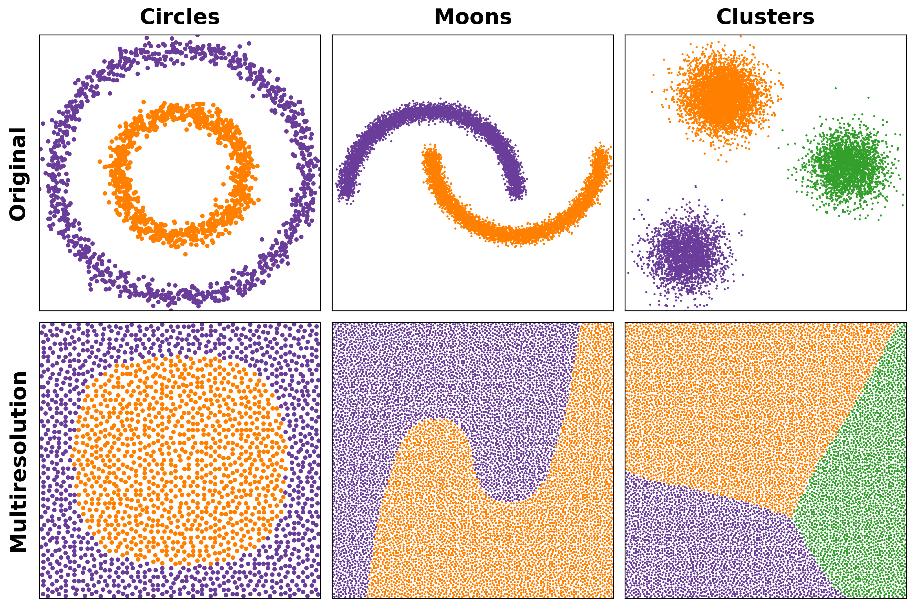

# Multiresolution Density-Equalizing Transformation for Scatterplots 

This repository accompanies the paper:

> H. Rave, V. Molchanov, Y. Tatsukawa, Q. Q. Ngo, S. Frey, T. Igarashi, and L. Linsen, "Multiresolution Density-Equalizing Transformation for Scatterplots," *IEEE Transactions on Visualization and Computer Graphics*, vol. 32, no. 10, pp. 8258–8272, 2026. DOI: [10.1109/TVCG.2026.3713630](https://doi.org/10.1109/TVCG.2026.3713630)
> 
> [](http://www.replicabilitystamp.org#https-github-com-hennesrave-rave2026-multiresolution-replicability)
> **The code in this repository has been verified and received the Graphics Replicability Stamp.**

The accepted manuscript of the paper is provided in [`paper.pdf`](paper.pdf).

> © 2026 IEEE.  Personal use of this material is permitted.  Permission from IEEE must be obtained for all other uses, in any current or future media, including reprinting/republishing this material for advertising or promotional purposes, creating new collective works, for resale or redistribution to servers or lists, or reuse of any copyrighted component of this work in other works.

The repository provides a self-contained reference implementation of the multiresolution
density-equalizing transformation and a script (`main.py`) that reproduces parts
of **Figure 12** from the paper. Running the script generates `example.png`, which
shows three datasets (Circles, Moons, Clusters) before and after the transformation.



## Requirements

- Python 3.8 or newer
- The Python packages listed in [`requirements.txt`](requirements.txt):
  `matplotlib`, `numpy`, `scipy`, `scikit-learn`, and `tqdm`

The script runs on the CPU by default. If [CuPy](https://cupy.dev/) is installed and
a compatible CUDA GPU is available, it automatically uses the GPU implementation for a
significant speedup. GPU support is optional and not required to reproduce the results.

## Installation

We recommend using a fresh virtual environment.

```bash
# 1. (Optional) Create and activate a virtual environment
python -m venv venv

# On Linux / macOS:
source venv/bin/activate
# On Windows (PowerShell):
venv\Scripts\Activate.ps1

# 2. Install the dependencies
pip install -r requirements.txt
```

### Optional: GPU acceleration

To enable GPU acceleration, additionally install the CuPy wheel that matches your
installed CUDA toolkit version, for example:

```bash
# For CUDA 12.x
pip install cupy-cuda12x

# For CUDA 11.x
pip install cupy-cuda11x
```

See the [CuPy installation guide](https://docs.cupy.dev/en/stable/install.html) for
details. If CuPy is not installed, the script transparently falls back to the CPU
implementation.

## Usage

Run the script from this directory:

```bash
python main.py
```

This computes the transformation for all three datasets and writes the resulting
figure to `example.png` in the current directory. A window with the figure is also
displayed. Depending on your hardware, the CPU version may take several minutes to
complete; the GPU version finishes considerably faster.

## Expected output

The generated `example.png` reproduces parts of Figure 12 from the paper: a 2×3 grid
of scatterplots showing the three datasets in their **original** layout (top row) and
after the **multiresolution** density-equalizing transformation (bottom row). A
reference copy of this figure is included in the repository.

## Optimized implementation

An optimized C++/CUDA implementation with Python bindings is available at:

<https://github.com/hennesrave/density-equalizing-transformations>

## Citation

If you use this code, please cite:

```bibtex
@article{rave2026_multiresolution,
  title   = {Multiresolution Density-Equalizing Transformation for Scatterplots},
  author  = {Rave, Hennes and Molchanov, Vladimir and Tatsukawa, Yuki and Ngo, Quynh Quang and Frey, Steffen and Igarashi, Takeo and Linsen, Lars},
  year    = {2026},
  journal = {IEEE Transactions on Visualization and Computer Graphics},
  doi     = {10.1109/TVCG.2026.3713630}
}
```

## License

The source code in this repository is released under the [BSD 3-Clause License](LICENSE).
The accompanying paper (`paper.pdf`) is © 2026 IEEE and is subject to the copyright
notice stated above.
